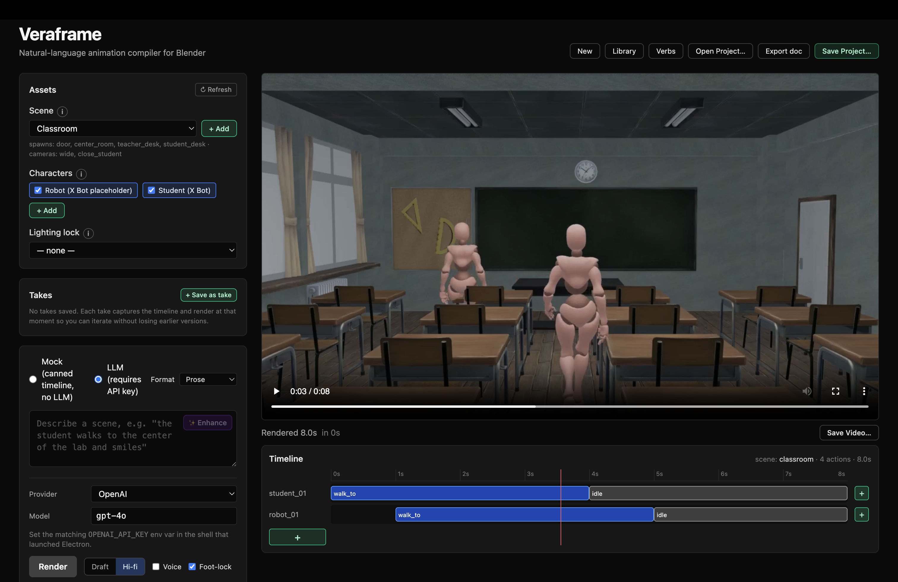

# Veraframe

A natural-language animation compiler for Blender. Type a scene description, get an editable, rendered video. Veraframe converts plain English into a structured timeline, hands it to a long-running Blender daemon that places NLA strips on a Mixamo rig, and renders the result with ffmpeg incremental-splice so re-renders are fast.



## Status

Feature-complete. Ships as an Electron desktop app over a long-lived Blender daemon. Cloud LLMs (OpenAI / Anthropic / Gemini) and local Ollama models both work.

The timeline is interactive: scrub the video, click an action to re-prompt it, drag block edges to retime, shift-drag to select a range and natural-language-edit just that window, right-click to lock an approved beat, drag verb chips onto lanes, save non-destructive takes, export beat-by-beat docs, switch to Screenplay mode and have the LLM break a screenplay into shots you can edit before render. Iterations re-render only the changed slice and ffmpeg-splice or -append it into the existing MP4.

## Pipeline

```
prompt / script / screenplay
  │
  ▼
LLM (LiteLLM)                       planner/
  │
  ▼
JSON timeline ── Pydantic validate ─ planner/schema.py
  │
  ▼
Validator pipeline (MoE)            planner/validators/
  reference_autofix                  ├─ snap "doorway" → "door"
  reference_check                    ├─ unresolved → retry feedback
  channel_conflicts                  ├─ overlap detection per channel
  dialog_companion                   ├─ auto-attach look_at to long talks
  beat_coherence                     └─ flag empty shots
  │
  ▼
Blender daemon (JSON-RPC over TCP)   blender_daemon/
  preprocessing                       ├─ per-shot camera_cut injection
  per-shot lighting                   ├─ project_style lighting lock
  AI camera suggester                 ├─ track_subject / two_shot picks
  two-pass dispatch                   └─ body actions, then cameras
  │
  ▼
NLA strips · constraints · markers   actions/  (20+ action types)
  │
  ▼
PNG sequence ─ Blender mp4 ──────►   per-render slice (draft / hi-fi)
  │
  ▼
ffmpeg concat / splice  ◄─ (incremental: edits + extensions)
ffmpeg adelay / amix    ◄─ (talk audio via Edge TTS)
  │
  ▼
out.mp4
```

## Quick start

```bash
# 1. Python deps
uv sync

# 2. Node deps (Electron app)
npm --prefix app install

# 3. Run the desktop app
npm --prefix app run dev
```

The Render button runs end-to-end (LLM → daemon → ffmpeg). **Mock** mode loads a pre-baked MP4 + timeline from `assets/fixtures/` so you can exercise the timeline editor without a render wait.

## Requirements

- Python 3.12+
- [`uv`](https://github.com/astral-sh/uv) for Python deps
- Node 20+ and npm for the Electron app
- Blender 5.x (`BLENDER_PATH` env var if not on `$PATH`; macOS `/Applications/Blender.app/...` is auto-detected)
- FFmpeg on `$PATH` (`brew install ffmpeg`) — used for incremental render merges and TTS audio muxing
- One of:
  - OpenAI / Anthropic / Gemini API key (`OPENAI_API_KEY`, `ANTHROPIC_API_KEY`, `GEMINI_API_KEY`)
  - **Ollama** running locally — the UI auto-detects installed models via `GET /api/tags`

## Authoring modes

The prompt textarea has a **Format** dropdown that chooses how your input is interpreted:

- **Prose** — one free-form description; the LLM picks the timing.
- **Script** — author timed lines yourself: `@0 alice walks to the door` / `@4 alice waves at bob` / `@6-10 they argue`. Parsed locally; explicit time windows feed straight into the LLM.
- **Screenplay** — paste actual screenplay prose (Fountain-style scene headings, character cues, dialog, parentheticals). The Render button flips to **Break down**: an LLM call segments the screenplay into estimated-timed beats which you review/edit/re-run in a preview panel before approving the render.

## Editing the timeline

Once a render lands, the timeline below the video is the main editing surface.

| Interaction | What it does |
|---|---|
| Click a lane / ruler | Seek the video to that point |
| Click + drag | Scrub-seek smoothly (rAF playhead, 60Hz) |
| Click an action block | Open the editor; re-prompt via the LLM, diff overlay, **Accept** → splice render |
| Drag a block edge | Retime that action; ffmpeg splices the new slice into the existing MP4 |
| Click `+` at end of a lane | Add a new action. Past the current end, the timeline **extends** and ffmpeg appends the tail |
| **Shift + drag** a range | Natural-language range edit — opens a panel; describe what should happen in `[start, end]`; LLM rewrites only that window |
| **Right-click** a block | Lock 🔒 it. Locked blocks block range edits that overlap them |
| Drop a verb-palette chip onto a lane | Open ActionEditor pre-filled with that verb; LLM resolves params |
| ✨ Enhance | Rewrite the prompt using actual asset names from the registry |

The incremental render strategy:
- **Edit / range-edit / retime** → `ffmpeg` splices the new slice in at `[start, end]`
- **Extend** past current end → `ffmpeg` appends the tail
- **First render of the session** → full render (no previous video to merge into)

## Power-user surfaces

**Verb palette.** Floating popover (toolbar **Verbs** button) groups every action type by family — Locomotion, Gesture, Face, Head, Pose, Speech, Camera, Stage, Motion clip. Drag a chip onto a lane to insert that action; lanes highlight on hover with a snap-time tooltip.

**Takes.** Snapshots of the timeline + render the user can flip between non-destructively. Persisted in the `.veraframe` project file. Save a take, iterate destructively in the editor, restore the original to compare.

**Character library.** Toolbar **Library** button opens a profile-rich browser of every installed character (description, default emotion, TTS voice) and motion clip. Per-row toggle / edit / remove with a "yours" badge on user-uploaded entries.

**Range edit.** Shift-drag a window on the timeline → a panel asks "what should happen here?" → the LLM emits a clamped list of actions for that window only. Merge logic preserves boundary-straddling actions outside the window.

**Frozen blocks.** Right-click any action to lock it. Locked actions get a 🔒 amber ring; range edits that overlap a locked block are refused with the specific action listed. Locks save with the project.

**Export doc.** Toolbar **Export doc** dumps a beat-by-beat Markdown documentation of the whole timeline; in range-edit mode an **Export range doc** button scopes the export to the shift-drag window. Includes header (range / shot count / action count), scene, characters, and per-shot action bullets with all type-specific params.

**Foot-lock (physics post-pass).** Render setting checkbox. When on, `walk_to` ties stride count to actual travel distance — feet plant where they land instead of sliding. Toggle off for the legacy duration-only formula to A/B compare.

**Project-level lighting lock.** A scene's lighting presets surface as a dropdown in the Assets panel. Setting a lock injects a default `set_lighting` action at every shot's start unless the author placed one there explicitly.

**Quality presets.** Draft (854×480 / 1 sample) for fast iteration; Hi-fi (1280×720 / 16 samples) for finals.

**Voice (TTS).** Voice checkbox in render settings. Every `talk` action is synthesized via Microsoft Edge TTS (no API key needed; OpenAI TTS optional) and ffmpeg-muxed into the final MP4 with per-clip offsets. Per-character voice override in the Library profile.

**Motion clips.** Upload a user-supplied FBX (e.g. Mixamo dance, custom kick) in the Library. It becomes an asset the LLM can schedule via `play_clip(character=alice, clip=spinning_kick, speed=1.2, loop=false)`.

## Supported actions

| action          | what it does                                                              |
|-----------------|---------------------------------------------------------------------------|
| `walk_to`       | Walk-cycle NLA strip + translation curve to a named target; foot-aligned stride formula; `style` ∈ walk/run/jog/sneak/march/limp; optional `emotion` |
| `idle`          | Mixamo idle NLA strip; optional `style` ∈ neutral/tired/alert/confident/bored/nervous |
| `turn_to`       | Rotate the character to face a target spawn point / character             |
| `look_at`       | Damped-track head-bone constraint, influence keyframed on/off             |
| `point_at`      | Right-arm IK pointing at a target; `bone_mask` override for left-arm      |
| `sit` / `stand` | Pose transitions                                                          |
| `smile` / `frown` / `blink` | Face shape-key ramps / pulses                                 |
| `talk`          | Viseme distribution from text; optional `look_at`, `emotion`, audio synth |
| `nod`           | Yes-nod head-bone pitch oscillation; layers cleanly over locomotion       |
| `shake_head`    | No-shake head-bone yaw oscillation; layers cleanly over locomotion        |
| `wave`          | Right-arm wave; `bone_mask=['left_arm']` for a left-handed wave           |
| `camera_cut`    | Bind a named camera preset                                                |
| `camera_dolly`  | Interpolate between two camera presets                                    |
| `track_subject` | Camera follows a character with a behind-and-above offset                 |
| `two_shot`      | Camera frames two characters from a side angle                            |
| `over_shoulder` | OTS framing: behind A, looking at B                                       |
| `orbit`         | Camera circles a target by `degrees`                                      |
| `set_lighting`  | Switch to a named lighting preset                                         |
| `play_clip`     | Drive a character with a user-uploaded motion FBX; optional `speed`, `loop` |

## Validator pipeline

`planner/validators/` runs a fixed-order pipeline of specialized passes after every LLM call:

1. **reference_autofix** — snap near-miss strings to the closest registry name (`doorway` → `door`) via `difflib` with 0.7 cutoff, so typos resolve without burning a retry round
2. **reference_check** — anything still broken surfaces as targeted feedback to the LLM retry loop
3. **channel_conflicts** — two `walk_to`s on the same character at the same time, etc.
4. **dialog_companion** — auto-attach `look_at` to long `talk` actions when there's exactly one other character in the shot
5. **beat_coherence** — flag shots with zero body actions

Each pass returns `(project, fixes, issues)`. Fixes are informational and surfaced in render logs; issues feed the existing retry loop with `[pass_name]` prefixes.

## Developer CLI

The Python pipeline is available headless for tests and one-off renders.

```bash
# Mock render (canned timeline, no LLM)
uv run veraframe --dev render --mock --out /tmp/out.mp4

# Prompt render
export OPENAI_API_KEY=...           # or ANTHROPIC_API_KEY / GEMINI_API_KEY
uv run veraframe --dev render \
  "the student walks to the center of the lab, smiles, then walks to the robot" \
  --out /tmp/out.mp4

# Switch provider/model via env vars
VERAFRAME_LLM_PROVIDER=ollama VERAFRAME_LLM_MODEL=llama3.1 \
  uv run veraframe --dev render "..." --out /tmp/out.mp4
```

## Repository layout

```
planner/                       LLM, schema, validator pipeline, CLI
  ├─ schema.py                 Pydantic timeline types (Project / Shot / Action union); BodyPart enum; bone_mask
  ├─ llm_client.py             LiteLLM wrapper, system prompt (registry + layering rules)
  ├─ registry.py               Asset specs (scenes / characters / animations / motion clips) + action vocabulary
  ├─ validator.py              Façade over the pipeline
  ├─ validators/               Specialized validator passes (MoE pipeline)
  │   ├─ reference_autofix.py
  │   ├─ reference_check.py
  │   ├─ channel_conflicts.py
  │   ├─ dialog_companion.py
  │   └─ beat_coherence.py
  ├─ run_planner.py            full-timeline subprocess
  ├─ run_action.py             single-action subprocess (block edits)
  ├─ run_enhance.py            prompt-rewrite subprocess
  ├─ run_range_edit.py         windowed natural-language edit subprocess
  ├─ run_screenplay_breakdown.py  screenplay → timed beats subprocess
  ├─ run_tts.py                Edge / OpenAI TTS subprocess
  └─ tts_client.py             TTS provider abstraction

blender_daemon/
  ├─ daemon.py                 JSON-RPC server inside `blender --background`
  ├─ action_executor.py        Two-pass dispatch (body actions then cameras); preprocessing chain
  ├─ render_manager.py         Quality presets + frame range
  └─ physics.py                Foot-aligned walk stride formula

actions/                       Per-action implementations (inside Blender)
  walk_to · idle · turn_to · look_at · point_at · sit · stand ·
  smile · frown · blink · talk · nod · shake_head · wave ·
  camera_cut · camera_dolly · track_subject · two_shot ·
  over_shoulder · orbit · set_lighting · play_clip

app/                           Electron + React + Tailwind desktop GUI
  ├─ src/main/                 Daemon supervisor, render orchestration, IPC handlers
  │   ├─ assets.ts             Scene / character / animation / motion-clip loader
  │   ├─ asset-helpers.ts      Asset-id validation, manifest builders, file detection
  │   ├─ project-file.ts       .veraframe (de)serialization (takes, frozen ids, projectStyle)
  │   ├─ registry-helpers.ts   AssetRegistry → RegistrySummary DTO
  │   ├─ planner.ts            Spawn `uv run python -m planner.*` per call
  │   ├─ render.ts             load_scene → load_character → execute_timeline → ffmpeg
  │   └─ ffmpeg.ts             Splice / append / mux helpers
  ├─ src/preload/              IPC bridge — `window.veraframe.*`
  └─ src/renderer/             React UI
      ├─ App.tsx               Top-level state + render orchestration
      ├─ components/           TimelinePanel, ActionEditor, AssetsPanel, VerbPalette,
      │                        TakesPanel, RangeEditPanel, ScreenplayPreview,
      │                        CharacterLibraryModal, AddMotionClipModal,
      │                        EditCharacterModal, EditSceneModal, AssetUploadModal,
      │                        AddCharacterModal, InfoTip
      ├─ verbs.ts              Verb catalog (every ActionType, grouped by family)
      ├─ script.ts             Script-mode parser (@<time> <prompt>)
      ├─ docs.ts               Markdown documentation formatter
      ├─ range-edit.ts         Pure timeline-merge logic
      ├─ takes.ts              Take data model + capture / rename / delete
      ├─ frozen.ts             Frozen action helpers + range-overlap detection
      └─ timeline-types.ts     Shared structural types

assets/
  scenes/        dark_lab/, classroom/      (programmatic + .blend)
  characters/    student_v1/, robot_v1/     (Mixamo X-Bot)
  animations/    idle/, walk_in_place/      (Mixamo)
  motions/       user-supplied FBX clips
  fixtures/      mock-classroom.mp4 + .json (pre-baked demo)

tests/           Pytest — unit + Blender integration (BLENDER_AVAILABLE=1)
app/src/**/*.test.ts  Vitest — assets, project-file, registry summary,
                                verbs, script, takes, range-edit, frozen, docs
docs/            Screenshots, design notes
```

## Tests

```bash
# Python
uv sync
uv run pytest                       # 292 unit tests; ~3s
BLENDER_AVAILABLE=1 uv run pytest   # also run the 42 Blender integration tests

# Electron app (TypeScript + Vitest)
npm --prefix app run typecheck
npm --prefix app test
```

## Architecture notes

- **Blender stays daemon-resident.** Cold-starting Blender is ~5s; we keep it running and send JSON-RPC calls (`load_scene`, `load_character`, `execute_timeline`, `render`) over a local socket. Daemon health is monitored; auto-restart on crash.
- **The planner is a subprocess per call.** Electron's main process spawns `uv run python -m planner.*` per LLM call — no in-process Python. Lets us swap models/providers per-request via env vars (`VERAFRAME_LLM_PROVIDER`, `VERAFRAME_LLM_MODEL`, `OLLAMA_API_BASE`).
- **Incremental render = full setup, partial frames.** Each edit still runs `load_scene` + `load_character` + `execute_timeline` (~10-20s) to put Blender in the right state, but renders only the changed frame range. ffmpeg merges that slice into the previous MP4 (`splice` for edits, `append` for extensions).
- **Mock mode is a pure fixture.** No Blender, no LLM — reads `assets/fixtures/mock-classroom.{mp4,json}` and registers the file under the custom `veraframe-render://` protocol so the existing player + editor pipeline works.
- **The validator is a pipeline, not an agent.** Specialized passes run in a fixed order after the LLM emits JSON; each is pure Python with deterministic behavior. Unfixable issues feed back into the existing retry loop with `[pass_name]` prefixes so debug logs are clear.
- **Gestures layer over locomotion via bone masks.** `wave` keyframes the right-arm bones at the pose level, overriding whatever the `walk_to` FBX strip writes for those bones; `nod` / `shake_head` touch only the head. The system prompt explains this to the LLM so it can schedule a wave concurrently with a walk.

## License

TBD.
